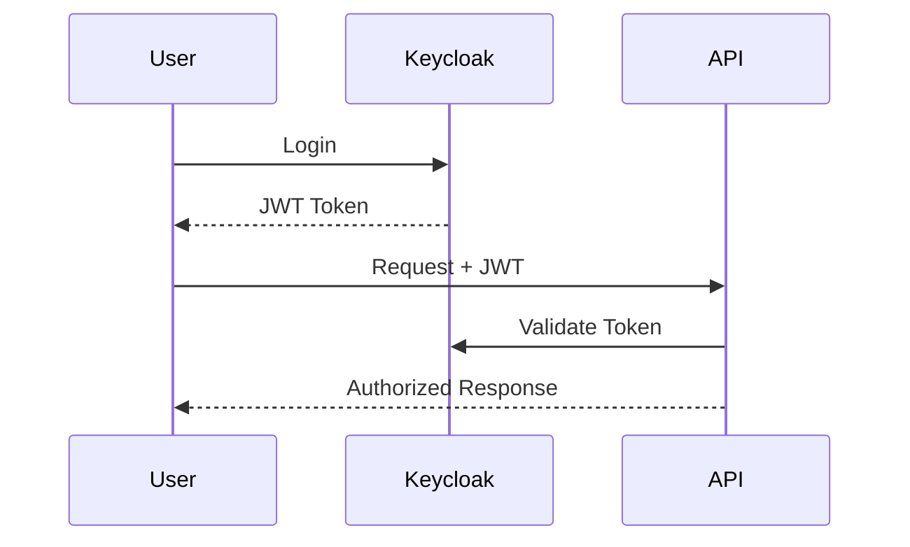
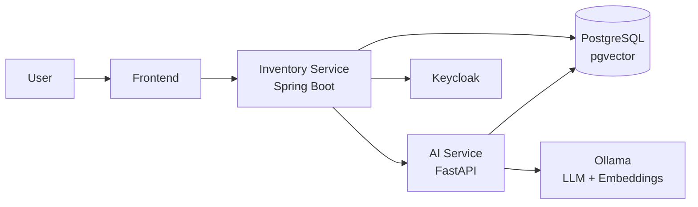
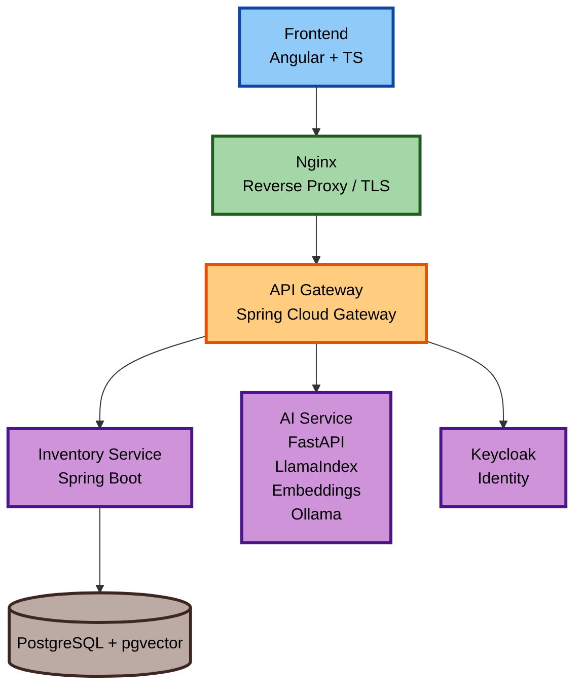

# 📦 NeuroInventory

<p align="center">

<strong>Plataforma Inteligente de Inventario impulsada por Búsqueda Semántica, RAG y Agentes de IA</strong>

<br/>

Una plataforma empresarial de inventario que combina arquitectura backend moderna con capacidades de inteligencia artificial generativa.

</p>

---

## 🚀 Resumen (Overview)

NeuroInventory es una plataforma de gestión de inventario diseñada para explorar la evolución de las aplicaciones empresariales tradicionales hacia sistemas inteligentes.

El proyecto combina:

* Gestión empresarial de inventario.
* Arquitectura basada en microservicios.
* Seguridad OAuth2/OIDC.
* Búsqueda semántica mediante embeddings.
* Retrieval-Augmented Generation (RAG).
* Modelos LLM locales.
* Preparación para integración con agentes IA mediante MCP.

El objetivo es demostrar cómo un sistema CRUD tradicional puede evolucionar hacia una plataforma capaz de comprender lenguaje natural y asistir en la toma de decisiones.

---

# ✨ Características principales

## 📦 Gestión de Inventario (Inventory Management)

Gestión completa del dominio de inventario:

* Productos.
* Categorías.
* Stock.
* Movimientos de inventario.
* Control de operaciones.
* Reglas de negocio.

---

## 🔐 Seguridad Empresarial (Enterprise Security)

Autenticación y autorización basada en estándares abiertos.

Implementado con:

* Keycloak.
* OAuth2.
* OpenID Connect.
* JWT.
* RBAC.

Flujo:



---

# 🧠 Capacidades de IA

## Búsqueda Semántica de Productos

El sistema utiliza *embeddings* para comprender la intención del usuario.

Ejemplo:

Consulta:

> "Laptop liviana para programadores"

Puede encontrar:

* Ultrabooks.
* Equipos profesionales.
* Notebooks con alta autonomía.

Aunque no existan coincidencias exactas de palabras.

Arquitectura:

```text
Product Data

      |
      v

Embedding Model

      |
      v

Vector Representation

      |
      v

PostgreSQL + pgvector
```

---

# 📚 Generación Aumentada por Recuperación (RAG)

NeuroInventory permite consultar documentación relacionada con productos.

Fuentes:

* Manuales técnicos.
* Fichas de producto.
* Documentación interna.
* Procedimientos.

Pipeline:

```text
Documents

    |
    v

Text Extraction

    |
    v

Chunking

    |
    v

Embeddings

    |
    v

Vector Database

    |
    v

Semantic Retrieval

    |
    v

LLM Response
```

Ejemplo:

Usuario:

> "¿Cómo realizo mantenimiento preventivo de este equipo?"

El sistema recupera información relevante y genera una respuesta contextualizada.

---

# 🏗 Arquitectura

Arquitectura basada en:

* Clean Architecture.
* Domain Driven Design.
* Microservicios ligeros.
* Separación de responsabilidades.

Vista general:



---

# 🧩 Servicios

## inventory-service

Servicio principal del dominio.

Responsabilidades:

* Productos.
* Categorías.
* Stock.
* Movimientos.
* Seguridad.
* APIs REST.

Tecnologías:

* Java 21.
* Spring Boot 4.
* Spring Security.
* Hibernate/JPA.

---

## ai-service

Servicio especializado de inteligencia artificial.

Responsabilidades:

* Generación de embeddings.
* Búsqueda vectorial.
* Pipeline RAG.
* Integración con LLM.

Tecnologías:

* Python 3.12.
* FastAPI.
* LlamaIndex.
* Sentence Transformers.

---

## mcp-server (Roadmap)

Servidor MCP para exponer capacidades del sistema como herramientas para agentes IA.

Ejemplo:

```text
buscar_producto()

consultar_stock()

crear_movimiento()

consultar_documentacion()
```

Permite que asistentes compatibles puedan interactuar con NeuroInventory utilizando herramientas del dominio.

---
## Frontend

Tecnologías:

- Angular 22

Responsabilidades:

- Dashboard de inventario.
- Gestión CRUD.
- Login con Keycloak.
- Chat IA.
- Búsqueda semántica.
- Visualización de stock.
---

# 🛠 Stack Tecnológico

## Backend

| Tecnología      | Uso                 |
| --------------- | ------------------- |
| Java 21         | Lenguaje principal  |
| Spring Boot     | Backend empresarial |
| Spring Security | Seguridad           |
| JPA/Hibernate   | Persistencia        |

---

## Stack de IA

| Tecnología            | Uso             |
| --------------------- | --------------- |
| Python                | Servicios IA    |
| FastAPI               | API IA          |
| LlamaIndex            | RAG             |
| Sentence Transformers | Embeddings      |
| Ollama                | Modelos locales |

---

## FrontEnd

| Tecnología            | Uso             |
| --------------------- | --------------- |
| Angular               |    Dashboard    |
---

## Datos

| Tecnología | Uso                      |
| ---------- | ------------------------ |
| PostgreSQL | Base relacional          |
| pgvector   | Almacenamiento vectorial |

---

## Infraestructura

| Tecnología     | Uso           |
| -------------- | ------------- |
| Docker         | Contenedores  |
| Docker Compose | Entorno local |
| Jenkins        | CI/CD         |

---

# 📂 Estructura del Repositorio

```text
NeuroInventory/

├── inventory-service/
│
│   ├── domain/
│   ├── application/
│   ├── infrastructure/
│
├── ai-service/
│
│   ├── api/
│   ├── rag/
│   ├── embeddings/
│
├── mcp-server/
│
├── frontend/
│
├── docker-compose.yml
│
└── docs/

    ├── architecture/
    └── adr/
```

---

# 🧪 Calidad y Pruebas

## Backend

Incluye:

* Unit tests.
* Integration tests.
* Testcontainers.
* API testing.

## AI Service

Incluye:

* Endpoint testing.
* Pipeline validation.
* Embedding tests.

---

# 📊 Observabilidad

Implementado:

* Spring Boot Actuator.
* Health checks.
* Structured logging.

Roadmap:

* OpenTelemetry.
* Prometheus.
* Grafana.

---

# 🧭 Roadmap

## Fase 1 — Backend Empresarial

- [ ] CRUD de inventario.
- [ ] Seguridad con Keycloak.
- [ ] APIs REST.

---

## Fase 2 — Búsqueda Semántica

- [ ] Generación de embeddings.
- [ ] Base de datos vectorial (pgvector).
- [ ] Descubrimiento semántico de productos.

---

## Fase 3 — Plataforma RAG

- [ ] Ingesta de documentos y manuales de productos.
- [ ] Respuestas contextualizadas.

---

## Fase 4 — Asistente de IA y Agentes

- [ ] Consultas en lenguaje natural.
- [ ] Integración con LLM local (Ollama).
- [ ] Servidor MCP y herramientas de dominio.

---

## Fase 5 — Infraestructura y Producción Avanzada
- [ ] Integración de Nginx como Reverse Proxy / TLS.
- [ ] Implementación de API Gateway (Spring Cloud Gateway).
- [ ] Despliegue en Kubernetes e Ingress.
- [ ] Observabilidad distribuida.



# 🏛 Decisiones de Arquitectura (ADRs)

Las decisiones técnicas relevantes están documentadas mediante ADRs.

Ejemplos:

* ¿Por qué PostgreSQL + pgvector?
* ¿Por qué separar AI Service?
* ¿Por qué Keycloak?
* ¿Por qué modelos locales?

Ubicación:

```text
/docs/adr
```

---

# 🎯 Visión del Proyecto

NeuroInventory representa la evolución de una aplicación empresarial moderna:

```text
CRUD Applications

        ↓

REST APIs

        ↓

Microservices

        ↓

Semantic Search

        ↓

RAG Systems

        ↓

AI Agents

        ↓

Intelligent Applications
```

El proyecto busca demostrar cómo integrar inteligencia artificial en sistemas empresariales reales manteniendo buenas prácticas de arquitectura, seguridad y diseño de software.
