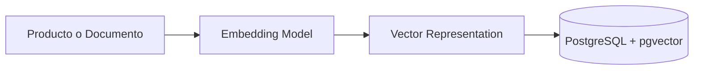

# ADR-0002: Utilizar PostgreSQL + pgvector como plataforma de datos

## Estado

Aceptada

---

## Contexto

NeuroInventory necesita almacenar información tradicional del negocio de inventario y, adicionalmente, soportar funcionalidades basadas en inteligencia artificial.

El sistema requiere manejar:

* Productos.
* Categorías.
* Stock.
* Movimientos de inventario.
* Documentación técnica.
* Embeddings generados por modelos de inteligencia artificial.
* Búsquedas por similitud semántica.

La arquitectura debe permitir evolucionar desde un sistema empresarial tradicional hacia una plataforma inteligente con capacidades de búsqueda semántica y Retrieval-Augmented Generation (RAG).

Se evaluaron diferentes estrategias para almacenar los datos relacionales y vectoriales.

---

## Decisión

Se adopta **PostgreSQL con la extensión pgvector** como plataforma principal de persistencia.

PostgreSQL será responsable de:

* Almacenamiento de datos transaccionales del dominio.
* Integridad referencial.
* Consultas relacionales.
* Gestión de migraciones.
* Almacenamiento de embeddings mediante vectores.

La extensión **pgvector** permitirá realizar búsquedas por similitud utilizando representaciones vectoriales generadas por modelos de embeddings.

La arquitectura inicial mantendrá una única plataforma de datos:

```text
                    PostgreSQL

        ┌───────────────────────────┐
        │                           │
        │   Datos relacionales      │
        │                           │
        │  - Products               │
        │  - Categories             │
        │  - Inventory              │
        │  - Movements              │
        │                           │
        ├───────────────────────────┤
        │                           │
        │   Datos vectoriales       │
        │                           │
        │  - Product embeddings     │
        │  - Document embeddings    │
        │  - RAG context            │
        │                           │
        └───────────────────────────┘
```

---

## Alternativas consideradas

## Base de datos relacional + base vectorial independiente

Ejemplo:

```text
PostgreSQL

+

Pinecone / Weaviate / Milvus
```

### Ventajas

* Mayor especialización para búsquedas vectoriales.
* Escalabilidad independiente del almacenamiento vectorial.
* Optimización específica para grandes volúmenes de embeddings.

### Desventajas

* Mayor complejidad operacional.
* Dos sistemas que mantener.
* Mayor dificultad para sincronizar datos.
* Más componentes en entornos locales y de desarrollo.

---

## Utilizar una base de datos vectorial como almacenamiento principal

Ejemplo:

```text
Vector Database

+

Metadata storage
```

### Ventajas

* Orientado principalmente a aplicaciones de IA.
* Optimizado para similitud semántica.

### Desventajas

* No cubre adecuadamente necesidades transaccionales.
* Requiere otra fuente de datos para el dominio empresarial.
* Aumenta la complejidad del modelo de persistencia.

---

## Mantener únicamente PostgreSQL sin pgvector

### Ventajas

* Arquitectura simple.
* Tecnología ampliamente conocida.

### Desventajas

* No permite búsquedas semánticas.
* No soporta los casos de uso relacionados con RAG.
* Requiere incorporar otra tecnología posteriormente.

---

## Consecuencias

## Positivas

* Arquitectura de datos simplificada.
* Menor cantidad de componentes operacionales.
* Integración natural entre datos del negocio y contexto de IA.
* Facilita el desarrollo local mediante Docker Compose.
* Permite implementar RAG utilizando una infraestructura conocida.

---

## Negativas

* PostgreSQL asume responsabilidades adicionales.
* En grandes volúmenes de vectores podría requerirse una solución especializada.
* La optimización de consultas vectoriales requiere conocimientos específicos.
* El crecimiento futuro puede requerir separar cargas transaccionales y analíticas.

---

## Consideraciones Técnicas

La información vectorial permanecerá desacoplada del modelo principal de negocio.

Los embeddings no sustituyen los datos originales, sino que representan una capa adicional para búsqueda inteligente.

Ejemplo:

```text
Producto

    |
    |
    +-- Información comercial
    |
    +-- Descripción
    |
    +-- Embedding vectorial
```

El flujo de generación será:



---

## Impacto en la Arquitectura

Esta decisión permite que NeuroInventory evolucione progresivamente:

```text
Aplicación CRUD

        ↓

API REST

        ↓

Datos relacionales

        ↓

Datos vectoriales

        ↓

Búsqueda semántica

        ↓

RAG

        ↓

Agentes IA
```

La incorporación de capacidades inteligentes no requiere rediseñar la plataforma de datos desde cero.

---

## Referencias

* PostgreSQL Documentation.
* pgvector Extension.
* Retrieval-Augmented Generation (RAG) architectures.
