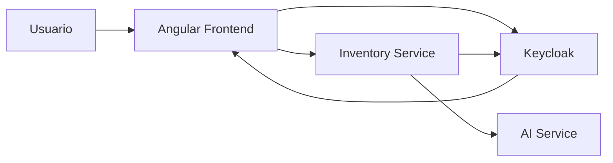
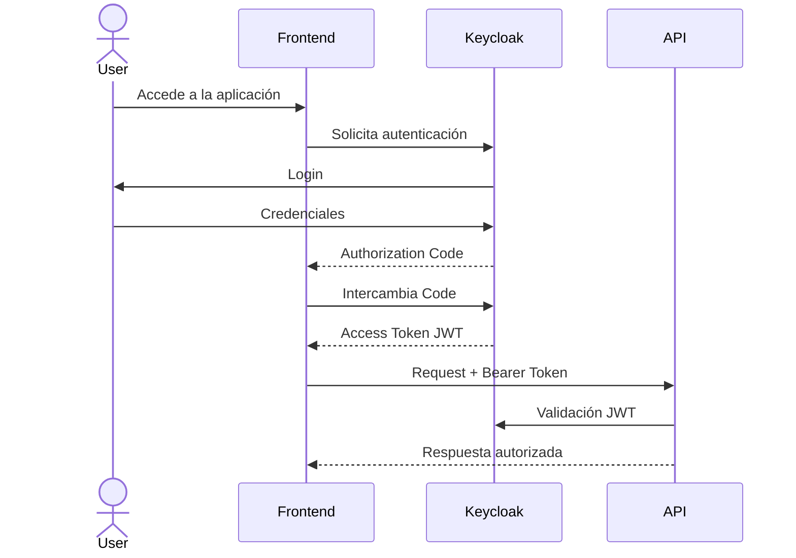

# ADR-0004: Utilizar Keycloak para identidad y seguridad

## Estado

Aceptada

---

## Contexto

NeuroInventory requiere un sistema de seguridad empresarial que permita gestionar:

* Autenticación de usuarios.
* Autorización basada en roles.
* Integración entre frontend y backend.
* Protección de APIs REST.
* Gestión centralizada de identidades.

La plataforma está compuesta por múltiples componentes:

* Frontend Angular.
* Inventory Service.
* AI Service.
* Futuras integraciones externas.
* Posibles agentes de IA.

La seguridad debe evitar implementaciones independientes dentro de cada componente y utilizar estándares ampliamente adoptados.

---

# Decisión

Se adopta **Keycloak** como proveedor central de identidad utilizando los estándares:

* OAuth 2.0.
* OpenID Connect (OIDC).
* JWT.
* Role-Based Access Control (RBAC).

Keycloak será responsable de:

* Autenticación de usuarios.
* Emisión de tokens.
* Gestión de roles.
* Gestión de clientes.
* Federación de identidades en futuras extensiones.

Los servicios internos confiarán en los tokens emitidos por Keycloak para validar la identidad y los permisos del usuario.

---

# Arquitectura de Seguridad



---

# Flujo de Autenticación

El flujo principal utiliza Authorization Code Flow con PKCE.



---

# Autorización

La autorización se implementa mediante RBAC (Role-Based Access Control).

Los roles representan permisos dentro de la aplicación.

Ejemplos:

```text id="1r3u6x"
ADMIN

INVENTORY_MANAGER

WAREHOUSE_OPERATOR

USER
```

Los servicios utilizan los roles contenidos en el JWT para determinar qué operaciones están permitidas.

Ejemplo:

```json id="tq16p8"
{
  "sub": "user-id",
  "preferred_username": "admin",
  "roles": [
    "ADMIN",
    "INVENTORY_MANAGER"
  ]
}
```

---

# Alternativas consideradas

## Implementar autenticación propia en el backend

Ejemplo:

```text id="v9p2y8"
Spring Security

+

Database Users

+

JWT personalizado
```

### Ventajas

* Control total sobre la implementación.
* Menor cantidad inicial de componentes.

### Desventajas

* Requiere implementar seguridad compleja.
* Mayor responsabilidad sobre almacenamiento de credenciales.
* Gestión manual de tokens y sesiones.
* Dificulta integraciones futuras.

---

## Utilizar servicios de identidad externos

Ejemplo:

* Auth0.
* Azure AD.
* Google Identity.

### Ventajas

* Soluciones maduras.
* Menor mantenimiento.

### Desventajas

* Dependencia de proveedores externos.
* Costos asociados.
* Menor control sobre la infraestructura.
* Posibles restricciones de personalización.

---

## Utilizar Keycloak

### Ventajas

* Open source.
* Basado en estándares abiertos.
* Compatible con OAuth2 y OIDC.
* Puede desplegarse localmente.
* Integración directa con Spring Security.
* Soporte de roles y clientes.

### Desventajas

* Requiere operación y mantenimiento.
* Añade un componente adicional a la infraestructura.

---

# Consecuencias

## Positivas

* Seguridad centralizada.
* Estándares ampliamente adoptados.
* Separación entre identidad y lógica de negocio.
* Facilita integrar nuevos clientes.
* Preparado para aplicaciones externas y agentes IA.
* Reduce código de autenticación dentro del backend.

---

## Negativas

* Introduce una dependencia de infraestructura adicional.
* Requiere configuración inicial.
* El equipo debe comprender OAuth2 y OIDC.
* La administración de usuarios depende de Keycloak.

---

# Integración con Spring Security

El Inventory Service funcionará como Resource Server OAuth2.

Responsabilidades:

* Validar JWT.
* Extraer roles.
* Aplicar restricciones de acceso.
* Proteger endpoints.

Ejemplo conceptual:

```text id="95mh7m"
HTTP Request

      |

Bearer JWT

      |

Spring Security

      |

Authorization Rules

      |

Controller
```

---

# Integración con Frontend

El frontend Angular utilizará Keycloak para:

* Inicio de sesión.
* Renovación de tokens.
* Cierre de sesión.
* Gestión de sesión del usuario.

Las llamadas al backend incluirán automáticamente:

```http id="4f8s4z"
Authorization: Bearer <JWT>
```

---

# Evolución Futura

Esta decisión permite incorporar:

* Multi-tenancy.
* Integración con proveedores corporativos de identidad.
* Single Sign-On (SSO).
* Permisos más granulares.
* Identidad para agentes IA.
* Auditoría de accesos.

Keycloak proporciona una base de seguridad preparada para la evolución de NeuroInventory hacia una plataforma empresarial inteligente.

---

# Referencias

* OAuth 2.0 Authorization Framework.
* OpenID Connect Core.
* Keycloak Documentation.
* Spring Security OAuth2 Resource Server.
