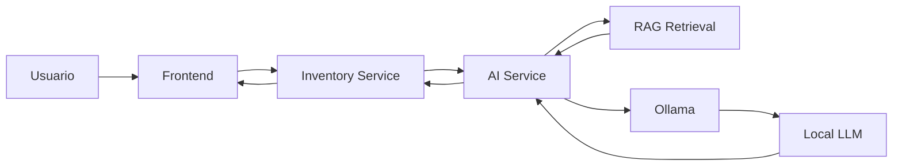

# ADR-0006: Utilizar modelos LLM locales mediante Ollama

## Estado

Aceptada

---

## Contexto

NeuroInventory incorpora capacidades de inteligencia artificial mediante:

* Búsqueda semántica.
* Retrieval-Augmented Generation (RAG).
* Asistencia mediante lenguaje natural.
* Futuras integraciones con agentes IA.

Estas funcionalidades requieren modelos de lenguaje capaces de:

* Comprender consultas de usuarios.
* Generar respuestas contextualizadas.
* Trabajar con información interna del sistema.
* Integrarse con fuentes de conocimiento privadas.

Se deben evaluar diferentes estrategias para proporcionar capacidades LLM.

Los principales criterios de decisión son:

* Privacidad de datos.
* Control sobre los modelos.
* Costos operativos.
* Facilidad de desarrollo local.
* Flexibilidad tecnológica.
* Posibilidad de ejecución en entornos empresariales.

---

# Decisión

Se adopta **Ollama** como plataforma inicial para ejecutar modelos de lenguaje locales dentro del entorno de NeuroInventory.

Los modelos LLM serán consumidos exclusivamente desde el **AI Service**, manteniendo la lógica de inteligencia artificial aislada del dominio principal.

Arquitectura:

```text id="q6o3r1"
                  AI Service

                      |
                      |

                  Ollama

                      |
                      |

              Local LLM Models
```

Ejemplos de modelos compatibles:

* Llama.
* Mistral.
* Gemma.
* Otros modelos compatibles con el ecosistema Ollama.

---

# Responsabilidades

## AI Service

Responsable de:

* Preparar prompts.
* Recuperar contexto mediante RAG.
* Gestionar embeddings.
* Orquestar llamadas al modelo.
* Aplicar reglas de negocio relacionadas con IA.

---

## Ollama

Responsable de:

* Ejecutar modelos localmente.
* Gestionar modelos descargados.
* Exponer una API local de inferencia.

Ollama no contiene lógica del dominio ni reglas empresariales.

---

# Flujo de Generación



---

# Alternativas consideradas

## Utilizar APIs comerciales de LLM

Ejemplos:

* OpenAI API.
* Anthropic API.
* Google Gemini API.

### Ventajas

* Modelos altamente optimizados.
* Sin gestión de infraestructura.
* Escalabilidad inmediata.

### Desventajas

* Dependencia de proveedores externos.
* Costos variables.
* Posible exposición de información sensible.
* Menor control sobre versiones de modelos.

---

## Entrenar un modelo propio desde cero

### Ventajas

* Control total del modelo.
* Adaptación específica al dominio.

### Desventajas

* Costos extremadamente altos.
* Requiere infraestructura especializada.
* Complejidad innecesaria para el objetivo del proyecto.

---

## Utilizar Ollama con modelos existentes

### Ventajas

* Ejecución local.
* Fácil integración.
* Permite cambiar modelos rápidamente.
* Adecuado para desarrollo y entornos privados.
* Reduce dependencia externa.

### Desventajas

* Requiere hardware adecuado.
* El rendimiento depende de los recursos disponibles.
* Los modelos pequeños pueden tener menor capacidad que servicios comerciales avanzados.

---

# Consecuencias

## Positivas

* Mayor control sobre los datos.
* Posibilidad de ejecutar la plataforma completamente local.
* Facilita pruebas y desarrollo sin depender de servicios externos.
* Permite experimentar con diferentes modelos.
* Reduce costos variables por consumo.
* Favorece escenarios empresariales donde los datos no deben salir de la organización.

---

## Negativas

* Requiere recursos computacionales locales.
* La calidad depende del modelo seleccionado.
* La operación de modelos requiere conocimientos adicionales.
* Puede necesitar infraestructura GPU para cargas elevadas.

---

# Consideraciones de Seguridad

Los datos utilizados en procesos de IA permanecen dentro de la infraestructura controlada por NeuroInventory.

El AI Service debe garantizar:

* Control del contexto enviado al modelo.
* Validación de documentos recuperados.
* Protección de información sensible.
* Registro adecuado de operaciones.

El modelo LLM no debe tener acceso directo a la base de datos empresarial.

---

# Evolución Futura

Esta decisión no bloquea la incorporación de otros proveedores o modelos.

La arquitectura permite evolucionar hacia:

* Modelos híbridos local/cloud.
* Modelos especializados por dominio.
* Inferencia mediante GPU dedicada.
* Modelos desplegados en Kubernetes.
* Agentes IA utilizando MCP.
* Evaluación automática de respuestas.

La abstracción del AI Service permite cambiar el motor LLM sin afectar al resto del sistema.

---

# Referencias

* Ollama Documentation.
* Large Language Model (LLM) architectures.
* Retrieval-Augmented Generation (RAG) patterns.
* Local AI inference architectures.
