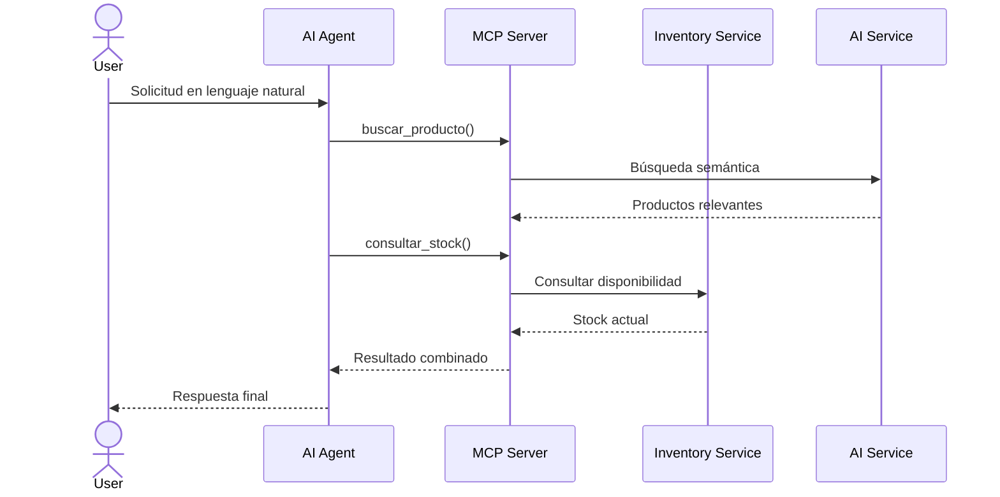

# ADR-0007: Adoptar MCP para integración con agentes IA

## Estado

Aceptada

---

## Contexto

NeuroInventory incorpora capacidades de inteligencia artificial que evolucionan desde consultas asistidas hacia sistemas capaces de interactuar con funcionalidades del negocio.

La plataforma requiere soportar escenarios donde un agente de IA pueda:

* Consultar productos.
* Consultar disponibilidad de stock.
* Analizar información del inventario.
* Consultar documentación técnica.
* Ejecutar operaciones autorizadas.
* Automatizar tareas repetitivas.

Los agentes de IA necesitan una forma estándar de interactuar con sistemas externos sin conocer detalles internos de implementación.

Exponer directamente las APIs REST existentes a agentes introduce varios problemas:

* El agente debe conocer contratos específicos de la aplicación.
* Cada integración requiere lógica personalizada.
* No existe una abstracción estándar de herramientas.
* Se dificulta controlar qué capacidades están disponibles para un agente.

Se requiere una capa de integración que permita exponer capacidades del dominio de forma controlada.

---

# Decisión

Se adopta **Model Context Protocol (MCP)** como mecanismo de integración entre agentes IA y las capacidades de NeuroInventory.

Se implementará un **MCP Server** encargado de exponer herramientas (tools) relacionadas con el dominio empresarial.

La arquitectura será:

```text
                        AI Agent

                            |
                            |

                         MCP

                            |
                            |

                     MCP Server

                            |
              ┌─────────────┴─────────────┐

              |                           |

      Inventory Service              AI Service

              |
              |

          PostgreSQL
```

El MCP Server actuará como una capa de adaptación entre agentes externos y los casos de uso internos.

---

# Responsabilidades

## MCP Server

Responsable de:

* Exponer herramientas disponibles para agentes.
* Validar solicitudes recibidas.
* Traducir llamadas MCP a operaciones internas.
* Gestionar contexto necesario para las herramientas.
* Aplicar controles de acceso.

El MCP Server no contiene reglas de negocio.

---

## Inventory Service

Mantiene la responsabilidad sobre:

* Productos.
* Stock.
* Movimientos.
* Reglas de negocio.
* Validaciones.
* Persistencia.

Las herramientas MCP deben invocar casos de uso existentes, evitando duplicar lógica.

---

## AI Service

Mantiene la responsabilidad sobre:

* Búsqueda semántica.
* RAG.
* Embeddings.
* Generación de respuestas.
* Procesamiento de conocimiento.

---

# Ejemplo de Herramientas MCP

Las capacidades expuestas se modelan como herramientas orientadas al dominio.

Ejemplos:

```text
buscar_producto()

Consulta productos utilizando búsqueda semántica.


consultar_stock()

Obtiene disponibilidad actual.


crear_movimiento()

Registra una entrada o salida de inventario.


consultar_documentacion()

Recupera información técnica mediante RAG.
```

Un agente no necesita conocer:

* Tablas de base de datos.
* Endpoints internos.
* Estructura de microservicios.

Únicamente conoce las capacidades disponibles.

---

# Flujo de Ejecución

Ejemplo: un usuario solicita a un agente:

> "Busca una laptop adecuada para desarrollo y verifica si hay stock."

Flujo:



---

# Alternativas consideradas

## Exponer APIs REST directamente a agentes

### Descripción

Permitir que los agentes consuman directamente los endpoints existentes.

Ejemplo:

```text
AI Agent

    |
    |

REST API

    |

Inventory Service
```

### Ventajas

* Implementación sencilla.
* Reutiliza infraestructura existente.
* No requiere una capa adicional.

### Desventajas

* Los agentes dependen de contratos específicos.
* No existe un modelo estándar de herramientas.
* Mayor exposición de APIs internas.
* Menor control sobre capacidades disponibles.

---

## Crear una capa propietaria de herramientas IA

### Descripción

Implementar un protocolo interno específico.

### Ventajas

* Total control del diseño.
* Adaptado completamente al sistema.

### Desventajas

* Menor interoperabilidad.
* Mayor mantenimiento.
* Dificulta integración con nuevos agentes.

---

## Adoptar MCP

### Ventajas

* Proporciona un estándar para herramientas de agentes.
* Desacopla agentes y aplicaciones.
* Permite múltiples clientes compatibles.
* Mantiene las capacidades del dominio controladas.

### Desventajas

* Tecnología en evolución.
* Requiere definir correctamente permisos y seguridad.
* Añade un componente adicional.

---

# Seguridad

El MCP Server debe aplicar controles estrictos.

Los agentes no tendrán acceso directo a:

* Base de datos.
* Servicios internos no autorizados.
* Operaciones administrativas.

Las herramientas expuestas deben definir:

* Qué acciones están permitidas.
* Qué usuario inició la solicitud.
* Qué permisos posee.
* Qué datos pueden ser retornados.

La identidad del usuario deberá propagarse mediante mecanismos seguros.

---

# Relación con Arquitectura Existente

MCP complementa las decisiones anteriores:

```text
ADR-0001
Clean Architecture

        ↓

ADR-0003
AI Service separado

        ↓

ADR-0004
Keycloak y seguridad

        ↓

ADR-0006
LLM local con Ollama

        ↓

ADR-0007
Agentes IA mediante MCP
```

MCP se convierte en la puerta de entrada controlada para agentes inteligentes.

---

# Consecuencias

## Positivas

* NeuroInventory puede ser utilizado por agentes IA compatibles.
* Las capacidades del dominio se exponen de forma explícita.
* Evita acceso directo de agentes a APIs internas.
* Facilita automatización empresarial.
* Permite evolucionar hacia arquitecturas agentic AI.

---

## Negativas

* Añade un nuevo componente arquitectónico.
* Requiere diseñar cuidadosamente las herramientas.
* Incrementa la superficie de seguridad.
* La tecnología todavía está evolucionando.

---

# Evolución Futura

Esta decisión permite incorporar:

* Asistentes internos de inventario.
* Automatización de operaciones.
* Agentes especializados por departamento.
* Flujos autónomos supervisados.
* Integración con plataformas externas compatibles con MCP.

La arquitectura queda preparada para evolucionar desde un sistema con IA asistida hacia una plataforma empresarial con agentes inteligentes.

---

# Referencias

* Model Context Protocol (MCP).
* Agentic AI architectures.
* Tool-based AI systems.
* Domain-Driven Design.
