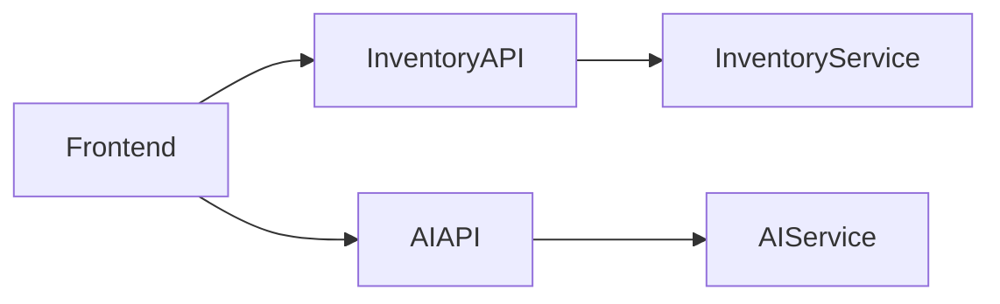

# API Architecture

## Objetivo

Las APIs de NeuroInventory constituyen el punto de integración entre el frontend, los servicios internos y futuras aplicaciones externas.

Su diseño sigue principios **RESTful**, priorizando la consistencia, la simplicidad y la evolución controlada de las interfaces.

Todas las APIs deben ofrecer una experiencia uniforme, independientemente del servicio que las implemente.

---

# Principios

Las APIs del proyecto siguen los siguientes principios:

* API First.
* Diseño orientado a recursos.
* Contratos estables.
* Versionado explícito.
* Respuestas consistentes.
* Seguridad por defecto.
* Documentación mediante OpenAPI.

---

# Arquitectura

Los servicios exponen APIs independientes.



Cada servicio es responsable de su propio contrato.

No existe acceso directo a la base de datos desde el frontend.

---

# Versionado

Todas las APIs deben versionarse.

Ejemplo:

```text
/api/v1/products

/api/v1/categories

/api/v1/inventory

/api/v1/search

/api/v1/chat
```

La introducción de cambios incompatibles requerirá una nueva versión de la API.

---

# Recursos

La API se organiza alrededor de recursos del dominio.

Ejemplos:

```text
/products

/categories

/inventory

/movements

/search

/chat
```

Los nombres de los recursos deben:

* Utilizar sustantivos.
* Estar en plural.
* Mantener consistencia en toda la plataforma.

---

# Métodos HTTP

Cada operación utiliza el verbo HTTP adecuado.

| Método | Uso                   |
| ------ | --------------------- |
| GET    | Consultar recursos    |
| POST   | Crear recursos        |
| PUT    | Reemplazar recursos   |
| PATCH  | Actualización parcial |
| DELETE | Eliminar recursos     |

Las operaciones deben ser idempotentes cuando el estándar HTTP así lo establece.

---

# Ejemplo de Endpoints

```text
GET    /api/v1/products

GET    /api/v1/products/{id}

POST   /api/v1/products

PUT    /api/v1/products/{id}

PATCH  /api/v1/products/{id}

DELETE /api/v1/products/{id}
```

---

# Formato de Respuesta

Las respuestas exitosas utilizan JSON.

Ejemplo:

```json
{
  "id": 15,
  "name": "Laptop Pro",
  "sku": "LP-1001",
  "stock": 25
}
```

Las colecciones podrán incluir información de paginación cuando sea necesario.

---

# Manejo de Errores

Los errores deben seguir una estructura uniforme.

Ejemplo:

```json
{
  "type": "https://api.neuroinventory.dev/problems/product-not-found",
  "title": "Product not found",
  "status": 404,
  "detail": "No product exists with identifier 15.",
  "instance": "/api/v1/products/15"
}
```


Esto facilita el manejo de errores tanto en el frontend como en integraciones externas.

---

# Códigos HTTP

Los códigos de estado deben utilizarse conforme a su significado.

| Código | Significado         |
| ------ | ------------------- |
| 200    | Operación exitosa   |
| 201    | Recurso creado      |
| 204    | Sin contenido       |
| 400    | Solicitud inválida  |
| 401    | No autenticado      |
| 403    | Sin permisos        |
| 404    | Recurso inexistente |
| 409    | Conflicto           |
| 422    | Error de validación |
| 500    | Error interno       |

---

# Autenticación

Todas las operaciones protegidas requieren un **Access Token JWT** emitido por Keycloak.

```http
Authorization: Bearer <access-token>
```

La validación del token es responsabilidad del Inventory Service.

---

# Paginación

Los recursos que devuelven colecciones deben soportar paginación.

Ejemplo:

```text
GET /api/v1/products?page=0&size=20&sort=name,asc
```

La implementación seguirá el modelo de paginación proporcionado por Spring Data.

---

# Filtrado y Búsqueda

Siempre que sea posible, las consultas soportarán filtros mediante parámetros.

Ejemplo:

```text
GET /api/v1/products?category=hardware

GET /api/v1/products?active=true

GET /api/v1/products?sku=ABC-100
```

Las búsquedas semánticas serán responsabilidad del AI Service y dispondrán de endpoints específicos.

---

# API de IA

Las capacidades inteligentes se exponen mediante recursos independientes.

Ejemplos:

```text
POST /api/v1/search

POST /api/v1/chat

POST /api/v1/rag/query
```

El Inventory Service delega estas operaciones al AI Service, manteniendo desacoplada la lógica del dominio.

---

# Documentación

Cada servicio publicará su especificación OpenAPI.

La documentación incluirá:

* Recursos disponibles.
* Parámetros.
* Modelos.
* Códigos de respuesta.
* Esquemas de autenticación.

Esto permitirá generar clientes y facilitar la integración con aplicaciones externas.

---

# Evolución

Las APIs están diseñadas para crecer sin romper compatibilidad con los consumidores existentes.

Las futuras versiones podrán incorporar:

* API Gateway.
* Rate limiting.
* Versionado avanzado.
* Webhooks.
* Eventos mediante mensajería.
* Integración con MCP para exponer capacidades del dominio a agentes de inteligencia artificial.

La evolución de las APIs deberá preservar contratos estables y mantener una experiencia consistente para todos los consumidores.

# Manejo de Errores (RFC 9457)

NeuroInventory utiliza la especificación **RFC 9457 - Problem Details for HTTP APIs** para representar errores de forma consistente.

Este estándar define un formato común para respuestas de error HTTP, permitiendo que clientes como el frontend u otras aplicaciones puedan interpretar los fallos de manera uniforme.

Todas las respuestas de error utilizan el siguiente Content-Type:

```http
Content-Type: application/problem+json
```

---

## Estructura del Error

Una respuesta de error sigue el formato definido por RFC 9457:

```json
{
  "type": "https://api.neuroinventory.dev/problems/product-not-found",
  "title": "Product not found",
  "status": 404,
  "detail": "No product exists with identifier 15.",
  "instance": "/api/v1/products/15"
}
```

Los campos estándar son:

| Campo      | Descripción                                        |
| ---------- | -------------------------------------------------- |
| `type`     | Identificador del tipo de problema.                |
| `title`    | Descripción general del error.                     |
| `status`   | Código HTTP asociado.                              |
| `detail`   | Información específica del fallo.                  |
| `instance` | Identificador de la solicitud que generó el error. |

---

## Errores de Validación

La especificación permite agregar propiedades adicionales para proporcionar información específica del dominio.

Ejemplo:

```json
{
  "type": "https://api.neuroinventory.dev/problems/validation-error",
  "title": "Validation failed",
  "status": 400,
  "detail": "One or more fields contain invalid values.",
  "errors": {
    "name": [
      "must not be blank"
    ],
    "sku": [
      "already exists"
    ]
  }
}
```

El campo `errors` es una extensión propia de la API para facilitar la corrección de datos desde el frontend.

---

## Errores del Dominio

Los errores relacionados con reglas de negocio utilizan tipos específicos.

Ejemplos:

| Situación              | Tipo                      |
| ---------------------- | ------------------------- |
| Producto inexistente   | `product-not-found`       |
| Stock insuficiente     | `insufficient-stock`      |
| SKU duplicado          | `duplicate-sku`           |
| Operación no permitida | `business-rule-violation` |

Ejemplo:

```json
{
  "type": "https://api.neuroinventory.dev/problems/insufficient-stock",
  "title": "Insufficient stock",
  "status": 409,
  "detail": "Cannot complete movement because available stock is 0."
}
```

---

## Errores de Seguridad

Los errores relacionados con autenticación y autorización mantienen el mismo formato.

Ejemplo:

```json
{
  "type": "https://api.neuroinventory.dev/problems/access-denied",
  "title": "Access denied",
  "status": 403,
  "detail": "The user does not have permission to perform this operation."
}
```

---

## Implementación en Spring Boot

El backend utiliza el soporte nativo de `ProblemDetail` proporcionado por Spring Framework.

Los errores son transformados mediante un manejador global:

```text
Exception

    |

    v

@RestControllerAdvice

    |

    v

ProblemDetail

    |

    v

application/problem+json
```

Esto garantiza que todos los controladores expongan errores con el mismo formato.

---

## Beneficios

El uso de RFC 9457 permite:

* Respuestas de error consistentes.
* Mejor integración con clientes externos.
* Menor acoplamiento entre frontend y backend.
* Documentación OpenAPI más clara.
* Facilidad para incorporar nuevos servicios.
