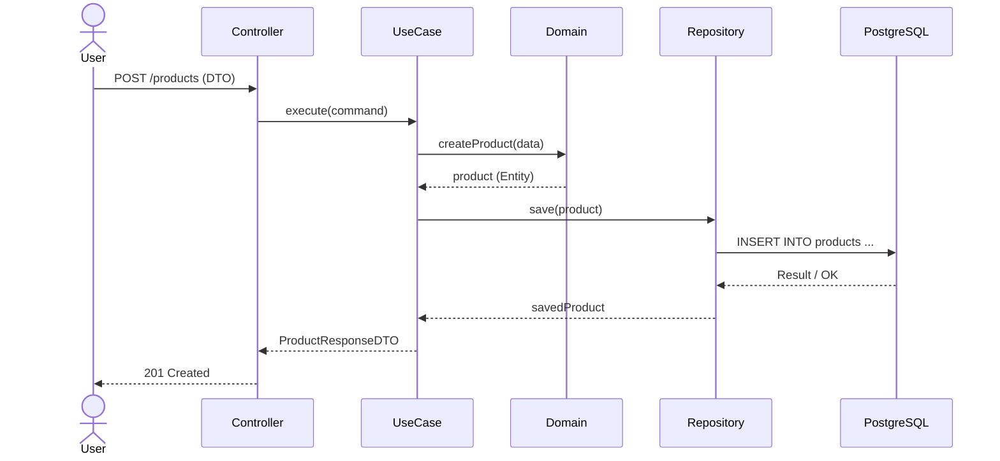
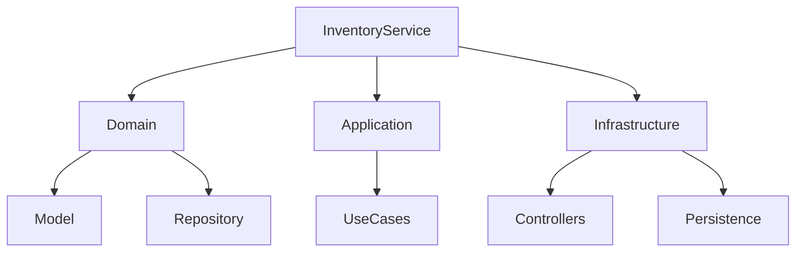

# Backend Architecture

## Objetivo

El **Inventory Service** es el núcleo de NeuroInventory y concentra la lógica de negocio relacionada con la gestión del inventario.

Su diseño sigue los principios de **Clean Architecture** y **Domain-Driven Design (DDD)** para mantener un bajo acoplamiento entre el dominio y las tecnologías utilizadas.

Los objetivos principales de esta arquitectura son:

* Mantener la lógica de negocio independiente del framework.
* Facilitar las pruebas unitarias e integración.
* Permitir el reemplazo de tecnologías sin afectar el dominio.
* Favorecer la evolución del sistema hacia una arquitectura distribuida.

---

# Principios

El backend se construye siguiendo los siguientes principios:

* El dominio no depende de Spring Boot.
* Las reglas de negocio son independientes de la infraestructura.
* Las dependencias siempre apuntan hacia el dominio.
* La persistencia es un detalle de implementación.
* Las APIs son únicamente un mecanismo de exposición del dominio.

---

# Capas de la Arquitectura

La estructura principal del servicio es la siguiente:

```text
inventory-service/

├── domain/
│   ├── model/
│   ├── repository/
│   ├── service/
│   ├── event/
│   └── exception/
│
├── application/
│   ├── usecase/
│   ├── dto/
│   ├── mapper/
│   └── port/
│
├── infrastructure/
│   ├── persistence/
│   ├── web/
│   ├── security/
│   ├── configuration/
│   └── integration/
│
└── bootstrap/
```

---

# Domain Layer

La capa **Domain** contiene el conocimiento del negocio y representa el centro de la aplicación.

No depende de:

* Spring Boot
* Hibernate
* Bases de datos
* REST
* Frameworks externos

Incluye:

## Model

Entidades y objetos de valor del dominio.

Ejemplos:

* Product
* Category
* Stock
* InventoryMovement

Estas clases representan conceptos del negocio y contienen reglas de negocio propias.

---

## Repository

Define contratos para acceder a la información.

Ejemplo:

```java
public interface ProductRepository {

    Optional<Product> findById(ProductId id);

    Product save(Product product);

}
```

El dominio conoce únicamente la interfaz, nunca la implementación.

---

## Domain Services

Contienen lógica que involucra múltiples entidades o procesos del negocio.

Ejemplos:

* Actualizar inventario.
* Validar movimientos.
* Calcular disponibilidad.
* Aplicar reglas de stock.

---

## Domain Events

Representan eventos relevantes del negocio.

Ejemplos:

* ProductCreated
* StockUpdated
* InventoryAdjusted

En futuras versiones estos eventos podrán publicarse mediante mensajería sin modificar el dominio.

---

# Application Layer

La capa de aplicación coordina los casos de uso.

No contiene reglas de negocio complejas.

Su responsabilidad es:

* Orquestar el dominio.
* Validar solicitudes.
* Coordinar repositorios.
* Transformar DTOs.
* Gestionar transacciones.

Cada operación del sistema se representa mediante un caso de uso.

Ejemplos:

```text
CreateProduct

UpdateProduct

DeleteProduct

RegisterInventoryMovement

FindProduct

SearchProducts
```

Cada caso de uso tiene una única responsabilidad.

---

# Infrastructure Layer

La infraestructura contiene todas las dependencias tecnológicas.

Aquí se encuentran:

* Spring Boot
* Spring MVC
* Spring Security
* Hibernate
* PostgreSQL
* Keycloak
* Clientes HTTP
* Integraciones externas

Esta capa implementa los contratos definidos por el dominio.

Ejemplo:

```text
ProductRepository

        ▲
        │

JpaProductRepository
```

De esta manera, el dominio permanece completamente desacoplado de JPA.

---

# Flujo de una Solicitud

El recorrido de una petición típica es el siguiente:

```text
HTTP Request

        │

Controller

        │

Use Case

        │

Domain Service

        │

Repository

        │

PostgreSQL
```

Cada componente tiene una responsabilidad específica, evitando concentrar lógica de negocio en los controladores.

---

# Organización por Responsabilidades

La distribución de responsabilidades dentro del backend es:

| Componente     | Responsabilidad                       |
| -------------- | ------------------------------------- |
| Controller     | Exponer la API REST                   |
| DTO            | Representar datos de entrada y salida |
| Mapper         | Conversión entre DTO y dominio        |
| Use Case       | Coordinar la ejecución del negocio    |
| Domain Service | Implementar reglas del negocio        |
| Repository     | Definir acceso a datos                |
| Infrastructure | Persistencia e integraciones          |

---

# Integración con IA

El Inventory Service no ejecuta modelos de inteligencia artificial directamente.

Cuando una operación requiere capacidades inteligentes, delega la responsabilidad al **AI Service** mediante una interfaz de integración.

Ejemplos:

* Búsqueda semántica de productos.
* Consulta de documentación mediante RAG.
* Generación de respuestas en lenguaje natural.

Esta separación mantiene el dominio independiente de tecnologías de IA.

---

# Manejo de Transacciones

Las transacciones se gestionan en la capa de aplicación.

Cada caso de uso define el límite transaccional necesario para garantizar la consistencia del dominio.

El objetivo es evitar transacciones distribuidas entre servicios.

---

# Manejo de Excepciones

Las excepciones del dominio representan errores de negocio.

Ejemplos:

* ProductNotFoundException
* InsufficientStockException
* DuplicateSkuException

Las excepciones técnicas (base de datos, red, autenticación, etc.) permanecen en la capa de infraestructura y se traducen a respuestas HTTP apropiadas mediante un manejador global.

---

# Escalabilidad

La arquitectura permite evolucionar sin modificar el dominio principal.

Las principales líneas de crecimiento previstas son:

* Incorporación de mensajería basada en eventos.
* Integración con un API Gateway.
* Despliegue de múltiples instancias del servicio.
* Observabilidad distribuida.
* Publicación de eventos de dominio.
* Integración con herramientas de IA mediante MCP.

Esta organización permite que el backend evolucione desde una aplicación monolítica modular hacia una arquitectura de microservicios, manteniendo el dominio estable y desacoplado de la infraestructura.

## 1. Clean Architecture

```Mermaid
flowchart TB

subgraph Domain
    Entities
    Repositories
    DomainServices
end

subgraph Application
    UseCases
    DTOs
    Mappers
end

subgraph Infrastructure
    Controllers
    Persistence
    Security
    Config
end

Infrastructure --> Application
Application --> Domain
```

## 2. Flujo de una petición HTTP



## 3. Comunicación entre servicios


## 4. Organización interna del proyecto


