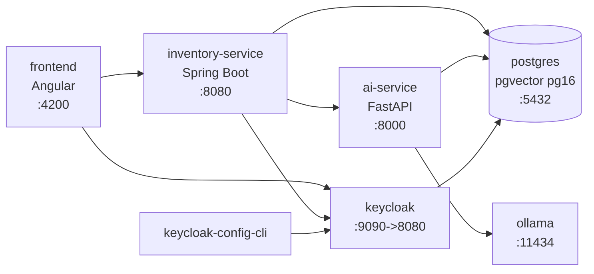

# Arquitectura de Contenedores

## Visión general

Toda la plataforma se ejecuta con Docker Compose (`docker-compose.yml`) sobre la red `neuroinventory-net`.

## Servicios

| Servicio | Imagen / Dockerfile | Puerto | Descripción |
| --- | --- | --- | --- |
| `postgres` | `pgvector/pgvector:pg16` | `${POSTGRES_PORT}:5432` | Base de datos relacional y vectorial. |
| `keycloak` | `quay.io/keycloak/keycloak:${KEYCLOAK_VERSION}` | `${KEYCLOAK_PORT}:8080` | Proveedor de identidad (start-dev). |
| `keycloak-config-cli` | `adorsys/keycloak-config-cli` | — | Importa el realm desde `config/realm.json`. |
| `ollama` | `docker/ollama/Dockerfile` | `${OLLAMA_PORT}:11434` | LLM local con reserva de GPU NVIDIA. |
| `ai-service` | `./ai-service/Dockerfile` | `${AI_SERVICE_PORT}:8000` | API de IA (FastAPI). |
| `inventory-service` | `./inventory-service/Dockerfile` | `${INVENTORY_SERVICE_PORT}:8080` | API principal (Spring Boot). |
| `frontend` | `./frontend/Dockerfile` | `4200:4200` | Aplicación web Angular. |

## Volúmenes

| Volumen | Servicio | Contenido |
| --- | --- | --- |
| `postgres_data` | postgres | Datos de la base de datos. |
| `ollama_data` | ollama | Modelos descargados. |

## Notas

- `keycloak-config-cli` y las dependencias `depends_on` con `condition: service_healthy` garantizan el orden de arranque.
- El servicio `ollama` requiere `nvidia-container-toolkit` para usar la GPU (ver `deployment.md`).
