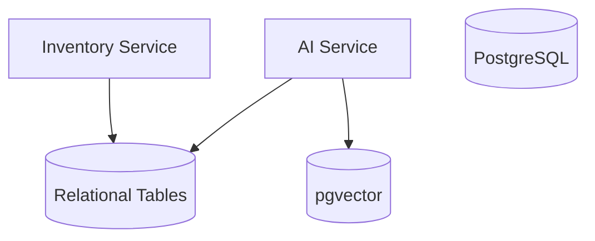
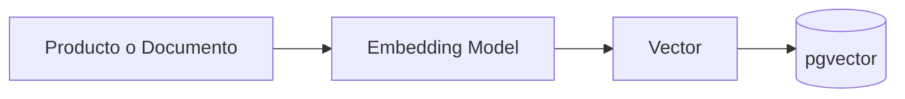
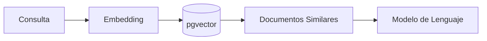

# Database Architecture

## Objetivo

NeuroInventory utiliza **PostgreSQL** como plataforma principal de persistencia, combinando almacenamiento relacional tradicional con capacidades de búsqueda vectorial mediante la extensión **pgvector**.

Esta estrategia permite mantener una única plataforma de datos para soportar tanto las operaciones del negocio como las funcionalidades de inteligencia artificial.

Los objetivos de la arquitectura de datos son:

* Garantizar la integridad de los datos del inventario.
* Mantener consistencia transaccional.
* Soportar búsquedas semánticas mediante embeddings.
* Facilitar la evolución del modelo de datos.
* Minimizar la complejidad de la infraestructura.

---

# Principios

La arquitectura de datos se basa en los siguientes principios:

* Una única fuente de verdad para la información del negocio.
* Separación lógica entre datos transaccionales y datos vectoriales.
* Normalización del modelo relacional cuando sea apropiado.
* Uso de claves primarias inmutables.
* Integridad referencial mediante claves foráneas.
* Persistencia transparente para el dominio.

---

# Arquitectura General

La base de datos almacena dos tipos de información.

## Datos Relacionales

Representan el estado operativo del sistema.

Ejemplos:

* Productos
* Categorías
* Stock
* Movimientos
* Usuarios (referenciados mediante Keycloak cuando corresponda)

---

## Datos Vectoriales

Representan información utilizada por los servicios de IA.

Ejemplos:

* Embeddings de productos.
* Embeddings de documentación.
* Fragmentos de documentos.
* Metadatos utilizados por el pipeline RAG.

---

# Vista General



---

# Modelo Relacional

Durante las primeras fases del proyecto el dominio se centra en las siguientes entidades.

```text
Category

    │

    │ 1

    │

    │ N

Product

    │

    │ 1

    │

    │ N

InventoryMovement
```

Las responsabilidades de cada entidad son:

| Entidad           | Propósito                                              |
| ----------------- | ------------------------------------------------------ |
| Category          | Clasificación de productos                             |
| Product           | Información principal del inventario                   |
| InventoryMovement | Registro de entradas, salidas y ajustes                |
| Stock             | Estado actual de existencias (según el modelo elegido) |

---

# Persistencia Vectorial

La extensión **pgvector** permite almacenar representaciones numéricas generadas por modelos de embeddings.

Cada vector representa el significado semántico de un elemento del sistema.

Ejemplos:

* Descripción de un producto.
* Manual técnico.
* Documento interno.
* Procedimiento operativo.

Los vectores permiten realizar búsquedas por similitud en lugar de coincidencias exactas de texto.

---

# Flujo de Indexación

Cuando un producto o documento es procesado por el AI Service, se sigue el siguiente flujo:



Este proceso se ejecuta de forma independiente a las operaciones transaccionales del inventario.

---

# Recuperación Semántica

Las consultas inteligentes utilizan el siguiente flujo:



El modelo de lenguaje recibe únicamente el contexto recuperado por la búsqueda vectorial, siguiendo el enfoque de Retrieval-Augmented Generation (RAG).

---

# Integridad de los Datos

La consistencia de la información se garantiza mediante:

* Claves primarias para todas las entidades.
* Restricciones de integridad referencial.
* Validaciones del dominio antes de la persistencia.
* Transacciones gestionadas por el Inventory Service.

Las operaciones de IA no modifican directamente la información del dominio.

---

# Evolución del Esquema

Las modificaciones del esquema se gestionarán mediante migraciones versionadas.

Los objetivos son:

* Mantener un historial de cambios.
* Facilitar despliegues reproducibles.
* Permitir la evolución del modelo sin pérdida de información.

Las migraciones incluirán tanto cambios en las tablas relacionales como en las estructuras necesarias para la búsqueda vectorial.

---

# Escalabilidad

La arquitectura permite evolucionar progresivamente según las necesidades del proyecto.

Evolución prevista:

* Optimización mediante índices especializados.
* Particionamiento de tablas con alto volumen de datos.
* Optimización de índices vectoriales.
* Replicación para consultas de solo lectura.
* Integración futura con soluciones especializadas si el volumen de vectores lo requiere.

Mientras el volumen de información sea manejable, PostgreSQL con pgvector proporciona una solución suficientemente robusta para soportar tanto las operaciones del negocio como las capacidades de inteligencia artificial sin introducir componentes adicionales.
