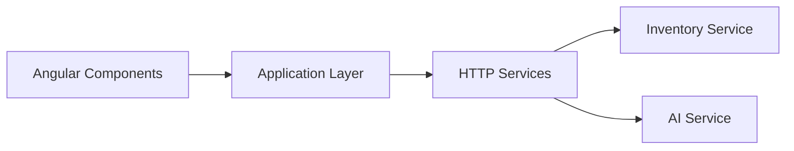
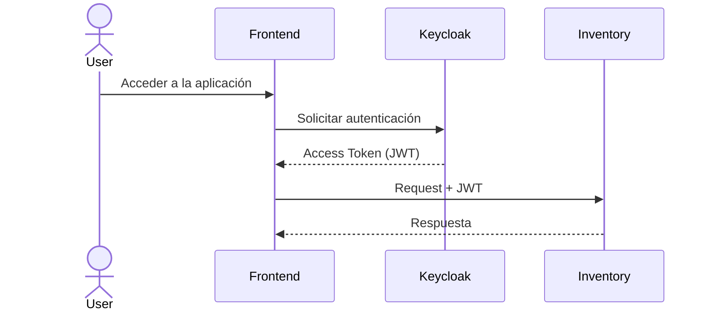

# Frontend Architecture

## Objetivo

El frontend de NeuroInventory proporciona la interfaz de usuario para la gestión del inventario y el acceso a las capacidades inteligentes de la plataforma.

Su diseño busca ofrecer una experiencia de usuario moderna, modular y mantenible, separando la lógica de presentación, el estado de la aplicación y la comunicación con los servicios backend.

La aplicación se desarrolla con **Angular** y consume las APIs expuestas por los distintos servicios del sistema.

---

# Objetivos de Diseño

La arquitectura del frontend persigue los siguientes objetivos:

* Mantener una estructura modular y escalable.
* Separar la lógica de negocio de la presentación.
* Centralizar la comunicación con los servicios backend.
* Facilitar la reutilización de componentes.
* Gestionar el estado de la aplicación de forma predecible.
* Integrarse con los mecanismos de autenticación empresarial.

---

# Arquitectura General

La aplicación se organiza en módulos funcionales que representan capacidades del negocio.

```text
frontend/

├── core/
│
├── shared/
│
├── features/
│   ├── authentication/
│   ├── dashboard/
│   ├── products/
│   ├── categories/
│   ├── inventory/
│   ├── ai-assistant/
│   └── reports/
│
├── layout/
│
└── assets/
```

---

# Capas de la Aplicación

La arquitectura distingue cuatro responsabilidades principales.

## Presentation

Contiene los componentes responsables de la interacción con el usuario.

Incluye:

* Pantallas.
* Componentes visuales.
* Formularios.
* Tablas.
* Diálogos.
* Navegación.

Los componentes deben contener la menor cantidad posible de lógica de negocio.

---

## Application

Coordina la interacción entre la interfaz y los servicios.

Responsabilidades:

* Gestión del estado.
* Orquestación de acciones del usuario.
* Validaciones de interfaz.
* Navegación.

Esta capa actúa como intermediaria entre la presentación y los servicios.

---

## Services

Encapsula toda la comunicación con el backend.

Cada servicio representa una API del sistema.

Ejemplos:

* ProductService
* CategoryService
* InventoryService
* AuthenticationService
* AIService

Ningún componente debe realizar llamadas HTTP directamente.

---

## Infrastructure

Incluye los elementos técnicos necesarios para el funcionamiento de la aplicación.

Ejemplos:

* HttpClient.
* Interceptores.
* Guards.
* Configuración.
* Manejo global de errores.
* Integración con Keycloak.

---

# Organización por Funcionalidades

La aplicación adopta una organización basada en funcionalidades (feature-based architecture).

Cada módulo encapsula:

* Componentes.
* Servicios específicos.
* Modelos.
* Rutas.
* Recursos propios.

Ejemplo:

```text
features/

└── products/

    ├── pages/
    ├── components/
    ├── services/
    ├── models/
    ├── routes.ts
    └── product.module.ts
```

Este enfoque facilita el mantenimiento y reduce el acoplamiento entre módulos.

---

# Comunicación con el Backend

Toda interacción con el sistema se realiza mediante APIs REST.



---

# Autenticación

La autenticación se basa en OAuth2 y OpenID Connect mediante Keycloak.

El flujo es el siguiente:



El token es enviado automáticamente en cada solicitud mediante un interceptor HTTP.

---

# Gestión del Estado

El estado de la aplicación se divide en dos categorías.

## Estado Global

Información compartida por toda la aplicación.

Ejemplos:

* Usuario autenticado.
* Roles.
* Configuración.
* Preferencias.

---

## Estado Local

Información específica de cada funcionalidad.

Ejemplos:

* Formulario de productos.
* Filtros de búsqueda.
* Datos de una tabla.
* Paginación.

Esta separación evita dependencias innecesarias entre módulos.

---

# Integración con IA

El frontend proporciona una experiencia unificada para las funcionalidades inteligentes de la plataforma.

Entre ellas:

* Búsqueda semántica de productos.
* Chat asistido por IA.
* Consulta de documentación mediante RAG.
* Recomendaciones contextuales.

Desde la perspectiva del usuario, estas capacidades forman parte del flujo normal de trabajo, aunque internamente sean atendidas por el AI Service.

---

# Manejo de Errores

La aplicación implementa un manejo centralizado de errores para:

* Errores de autenticación.
* Errores de autorización.
* Errores de validación.
* Errores de red.
* Errores inesperados del servidor.

El objetivo es ofrecer mensajes claros al usuario y mantener una experiencia consistente.

---

# Escalabilidad

La arquitectura del frontend está preparada para incorporar nuevas funcionalidades sin afectar los módulos existentes.

Entre las capacidades previstas se encuentran:

* Paneles de análisis.
* Reportes avanzados.
* Gestión de múltiples almacenes.
* Notificaciones en tiempo real.
* Dashboards personalizados.
* Integración con agentes de IA.

La organización modular facilita el crecimiento de la aplicación manteniendo una base de código coherente y de fácil mantenimiento.
