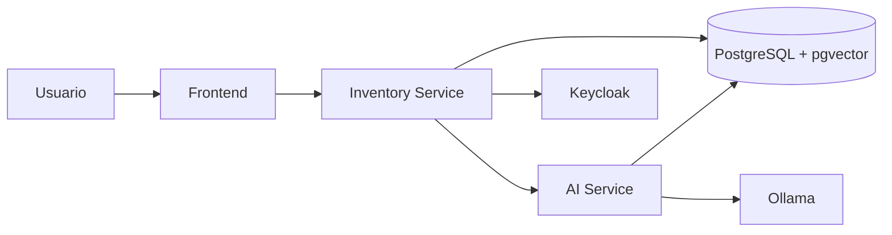

# Arquitectura General

## Propósito

NeuroInventory es una plataforma de gestión de inventario diseñada bajo una arquitectura desacoplada, extensible y preparada para integrar capacidades de inteligencia artificial.

La arquitectura separa claramente las responsabilidades del dominio de negocio, la experiencia de usuario y los servicios especializados de IA, permitiendo que cada componente evolucione de forma independiente.

Los objetivos principales son:

* Mantener una arquitectura empresarial mantenible y escalable.
* Incorporar capacidades de IA sin acoplarlas al dominio principal.
* Facilitar la evolución hacia arquitecturas distribuidas.
* Utilizar estándares abiertos para autenticación y autorización.
* Permitir la integración futura con agentes de IA mediante el Model Context Protocol (MCP).

---

# Principios Arquitectónicos

La solución se basa en los siguientes principios:

* **Separación de responsabilidades (Separation of Concerns).**
* **Clean Architecture** para aislar el dominio de la infraestructura.
* **Domain-Driven Design (DDD)** para modelar el negocio de inventario.
* **Arquitectura orientada a servicios**, donde cada servicio tiene una responsabilidad claramente definida.
* **API First**, exponiendo capacidades mediante interfaces REST.
* **Security by Design**, utilizando OAuth2 y OpenID Connect desde el inicio.
* **AI as a Service**, manteniendo las capacidades de IA fuera del dominio principal.

---

# Componentes Principales

La plataforma está compuesta por los siguientes componentes:

## Frontend

Aplicación web desarrollada con Angular responsable de la interacción con el usuario.

Responsabilidades:

* Autenticación mediante Keycloak.
* Gestión del inventario.
* Visualización del estado del sistema.
* Consultas inteligentes mediante IA.
* Administración de productos y stock.

---

## Inventory Service

Servicio principal del negocio implementado con Spring Boot.

Responsabilidades:

* Gestión de productos.
* Gestión de categorías.
* Control de inventario.
* Movimientos de stock.
* Aplicación de reglas de negocio.
* Exposición de la API REST.

Este servicio constituye el núcleo del dominio y no depende de tecnologías relacionadas con IA.

---

## AI Service

Servicio especializado implementado con FastAPI.

Responsabilidades:

* Generación de embeddings.
* Búsqueda semántica.
* Pipeline RAG.
* Comunicación con modelos LLM.
* Procesamiento de documentos.

Al mantener este servicio desacoplado, es posible evolucionar o sustituir la tecnología de IA sin afectar al dominio empresarial.

---

## Keycloak

Proveedor de identidad responsable de:

* Autenticación.
* Autorización.
* Gestión de usuarios.
* Gestión de roles.
* Emisión y validación de tokens JWT.

Toda la seguridad del sistema se centraliza en este componente.

---

## PostgreSQL + pgvector

Base de datos utilizada tanto para información transaccional como para almacenamiento vectorial.

Se distinguen dos tipos de datos:

* Datos relacionales del negocio.
* Representaciones vectoriales utilizadas por los modelos de IA.

Esta estrategia simplifica la infraestructura al evitar la incorporación de una base vectorial independiente durante las primeras fases del proyecto.

---

## LLM Local

Los modelos de lenguaje se ejecutan localmente mediante Ollama.

Su utilización incluye:

* Generación de respuestas.
* Recuperación aumentada por contexto (RAG).
* Comprensión del lenguaje natural.
* Asistencia inteligente al usuario.

El uso de modelos locales reduce la dependencia de servicios externos y facilita la protección de información sensible.

---

# Vista de Alto Nivel

---

# Flujo General

Un flujo típico de la aplicación sigue estos pasos:

1. El usuario inicia sesión mediante Keycloak.
2. El frontend obtiene un token JWT.
3. Las solicitudes autenticadas son enviadas al Inventory Service.
4. El dominio procesa las operaciones del inventario.
5. Cuando una operación requiere capacidades inteligentes, el Inventory Service delega la solicitud al AI Service.
6. El AI Service consulta los embeddings, recupera información contextual y, si es necesario, utiliza un modelo LLM para generar una respuesta.
7. La respuesta vuelve al Inventory Service y posteriormente al frontend.

---

# Evolución Arquitectónica

La arquitectura está diseñada para crecer de manera incremental.

## Estado inicial

* Aplicación empresarial.
* API REST.
* Persistencia relacional.

## Evolución prevista

* Incorporación de búsqueda semántica.
* Integración de RAG.
* Automatización mediante agentes de IA.
* API Gateway.
* Despliegue en Kubernetes.
* Observabilidad distribuida.
* Integración mediante MCP.

Cada etapa añade capacidades sin requerir cambios significativos en el dominio principal, preservando un bajo acoplamiento entre componentes.
