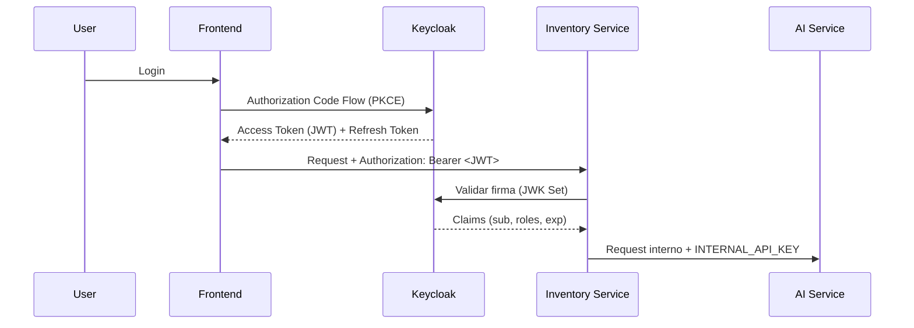

# Seguridad

## Keycloak

Keycloak es el proveedor de identidad central. Se despliega con `start-dev` y su configuración se importa automáticamente desde `config/realm.json` mediante `keycloak-config-cli`.

- **Realm:** `neuroinventory`
- **Cliente público:** `frontend-client` (usado por la app Angular)
- **Credenciales de bootstrap:** variables `KC_BOOTSTRAP_ADMIN_USERNAME` / `KC_BOOTSTRAP_ADMIN_PASSWORD`

## Flujo OAuth2 / OIDC

## Validación de tokens

- `inventory-service` actúa como **OAuth2 Resource Server** de Spring Security.
- Valida la firma del JWT contra el JWK Set de Keycloak:
  - `SPRING_SECURITY_OAUTH2_RESOURCESERVER_JWT_ISSUER_URI`
  - `SPRING_SECURITY_OAUTH2_RESOURCESERVER_JWT_JWK_SET_URI`
- Los claims de roles del token se mapean a authorities de Spring.

## Roles y permisos

Definidos en el realm (`config/realm.json`). Los endpoints de la API se protegen por rol (por ejemplo, operaciones de escritura restringidas a administradores de inventario).

## Seguridad entre servicios

- Llamadas `inventory-service` → `ai-service` se autentican con la cabecera interna `INTERNAL_API_KEY` (variable compartida).
- La red interna `neuroinventory-net` aísla la comunicación entre contenedores; solo los puertos publicados en `docker-compose.yml` son accesibles desde el host.

## Errores

Los errores de API siguen **RFC 9457 (Problem Details)**, con `BASE_PROBLEM_URI` como URI base de los tipos de problema.
